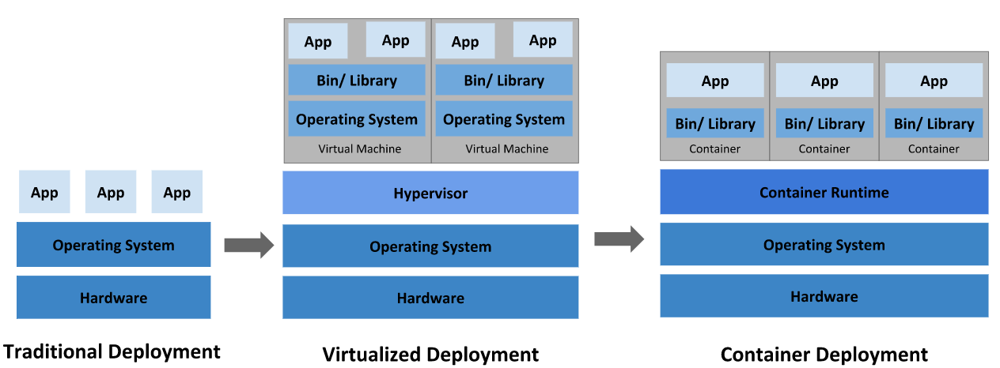

## 가상화 기술 이해하기

### 🧠 가상 메모리 동작 원리

```
            Virtual Memory
             Process
            (고유공간 Mem) 보장        MS-Word   Chrome   Java
                                      |        |         |
User mode    File System             [각 프로세스별 독립 공간]
----------------------------------------------------
Kernel mode. MMU + Page Table + Swap Manager
         

S/W           Driver
----------------------------------------------------
H/W         CPU   +        RAM + HDD/SSD
                          Physical Memory + Swap Area
```

보통 메모리라고 하면 주기억장치인 RAM을 말하는데, 이 RAM과 보조기억장치인 HDD/SSD를 합쳐서 추상화한 논리적인 메모리공간이 Virtual Memory입니다.

**핵심은 이거예요**: 프로세스 입장에서는 자신이 사용하는 메모리가 실제로 RAM에 있는지 디스크에 있는지 전혀 몰라도 된다는 점이죠. 운영체제가 MMU(Memory Management Unit)와 페이지 테이블을 사용해서 가상 주소를 물리 주소로 변환해주거든요.

그리고 중요한 건, **이 가상메모리 공간은 프로세스마다 완전히 독립적**이라는 점입니다. MS-Word가 0x1000 주소를 사용하고, Chrome도 0x1000 주소를 사용할 수 있어요. 각자 다른 물리 메모리 위치에 매핑되니까 서로 간섭하지 않죠.

### **페이지와 프레임의 개념**

가상 메모리는 **페이지(Page)**라는 고정 크기 단위로 관리돼요. 보통 4KB씩이죠.

```
가상 메모리 주소 (32비트 기준):
┌─────────────────────┬─────────────────────────┐
│   Page Number       │     Page Offset         │
│     (20비트)         │      (12비트)           │
│    어느 페이지?      │    페이지 내 어디?       │
└─────────────────────┴─────────────────────────┘

물리 메모리:
┌─────────────────────┬─────────────────────────┐
│   Frame Number      │     Page Offset         │
│     (20비트)         │      (12비트)           │
│   어느 프레임?       │    프레임 내 어디?       │
└─────────────────────┴─────────────────────────┘
```

**페이지**: 가상 메모리의 4KB 단위 블록
**프레임**: 물리 메모리의 4KB 단위 블록

각 프로세스는 자신만의 **페이지 테이블**을 가지고 있어서, 자신의 페이지 번호를 물리 메모리의 프레임 번호로 변환해요.

### **페이지 테이블이 실제로 어떻게 동작하나?**

```
페이지 테이블 엔트리:
┌──────────────┬─────┬─────┬─────┬─────┬─────┐
│ Frame Number │Valid│Dirty│Ref  │Pres │ ... │
│   (물리위치)  │유효 │수정 │참조 │존재 │     │
└──────────────┴─────┴─────┴─────┴─────┴─────┘

Valid 비트: 이 페이지가 유효한가?
Dirty 비트: 이 페이지가 수정되었나?
Reference 비트: 최근에 접근했나?
Present 비트: 물리 메모리에 있나?
```

프로그램이 메모리에 접근할 때:

1. CPU가 가상 주소 0x12345678을 요청
2. MMU가 페이지 번호(0x12345)와 오프셋(0x678)으로 분할
3. 페이지 테이블에서 0x12345번 페이지 찾기
4. Present 비트 확인
    - 1이면: 물리 메모리에 있음 → 바로 접근
    - 0이면: 디스크에 있음 → 페이지 폴트 발생!

### **페이지 폴트가 발생하면?**

이게 진짜 중요한 부분이에요.

```
페이지 폴트 처리 과정:
1. CPU가 가상 주소 접근 시도
2. MMU가 페이지 테이블 확인 → Present = 0
3. 하드웨어 인터럽트 발생 (페이지 폴트)
4. CPU가 OS의 페이지 폴트 핸들러로 점프
5. OS가 상황 판단:
   a) 처음 접근: 새 프레임 할당
   b) 스왑 아웃됨: 디스크에서 로드
   c) 잘못된 접근: Segmentation Fault
6. 페이지 테이블 업데이트
7. 원래 명령어 재실행
```

### **스왑 메커니즘**

물리 메모리가 부족하면 어떻게 될까요?

```
스왑 알고리즘 (LRU 예시):
┌─────────────────────────────────────────────────┐
│ 물리 메모리 (4개 프레임만 있다고 가정)            │
│ ┌─────┬─────┬─────┬─────┐                      │
│ │Frame│Frame│Frame│Frame│                      │
│ │  0  │  1  │  2  │  3  │                      │
│ │Page │Page │Page │Page │                      │
│ │  A  │  B  │  C  │  D  │                      │
│ └─────┴─────┴─────┴─────┘                      │
└─────────────────────────────────────────────────┘

새로운 Page E가 필요하면:
1. LRU 알고리즘으로 가장 오래된 페이지 찾기 (예: Page A)
2. Page A의 Dirty 비트 확인
   - Dirty = 1: 수정됨 → 디스크에 저장 후 제거
   - Dirty = 0: 읽기만 함 → 그냥 제거
3. Frame 0에 Page E 로드
4. 페이지 테이블 업데이트
```

메모리가 부족할 때는 잘 안 쓰는 페이지들을 디스크의 **스왑 영역**으로 내보내고, 필요할 때 다시 RAM으로 가져와요. 이 과정이 페이지 스왑입니다.

### 🖥️ VMware 하드웨어 가상화

```
              Process            Linux (Guest OS)
                               ------------
                               | usermode  | 
                               |           |
User mode      File - Socket   | kernelmode| 
----------------------------------------------------
Kernel mode      TCP/IP        |  Virtual  |
                               | Hardware  |
                 Network       |  (vNIC)   |
                               |-----------|
                      VM       Virtual Switch
S/W           Driver  Network  (VMware 가상 스위치)
                      Driver   
----------------------------------------------------
H/W               Physical NIC (실제 네트워크 카드)
```

자, 여기서 물리적인 NIC이 1개만 있다고 해보죠. 현재 PC가 윈도우인데 VMware를 설치해서 리눅스를 돌린다면?

**이렇게 동작해요**: 리눅스는 VMware 안에서 하나의 프로세스처럼 실행되는데, 자기만의 완전한 운영체제 환경을 가져요. usermode, kernel mode, 그리고 하드웨어까지 다 있죠.

### **하이퍼바이저의 역할**

VMware는 **하이퍼바이저(Hypervisor)**라고 불러요. 이게 물리 하드웨어와 가상 머신 사이에서 중재자 역할을 하죠.

```
하이퍼바이저 구조:
┌─────────────────────────────────────────────────┐
│ VM1 (Linux)  │ VM2 (Windows) │ VM3 (FreeBSD)   │
│ ┌─────────┐   │ ┌─────────┐    │ ┌─────────────┐ │
│ │Guest OS │   │ │Guest OS │    │ │Guest OS     │ │
│ │+ Apps   │   │ │+ Apps   │    │ │+ Apps       │ │
│ └─────────┘   │ └─────────┘    │ └─────────────┘ │
└─────────────────────────────────────────────────┘
│          Hypervisor (VMware ESXi)               │
│   ┌─────────────────────────────────────────┐   │
│   │ CPU 스케줄링 │ 메모리 관리 │ I/O 관리   │   │
│   └─────────────────────────────────────────┘   │
└─────────────────────────────────────────────────┘
│              Physical Hardware                  │
│         CPU + RAM + NIC + Storage               │
└─────────────────────────────────────────────────┘
```

### **CPU 가상화**

물리 CPU가 4코어인데 VM을 3개 돌린다면?

```
CPU 가상화:
Physical CPU (4 Core) → Hypervisor → vCPU 할당
                                   ├─ VM1: 2 vCPU
                                   ├─ VM2: 1 vCPU  
                                   └─ VM3: 2 vCPU (총 5개?)

실제로는 시분할로 동작:
Time Slice 1: VM1이 Core 0,1 사용
Time Slice 2: VM2가 Core 0 사용
Time Slice 3: VM3이 Core 2,3 사용
...반복
```

### **메모리 가상화**

이게 좀 복잡해요. **3단계 주소 변환**이 일어나거든요.

```
메모리 가상화 3단계:
1. Guest Virtual Address (GVA)
   ↓ Guest OS의 페이지 테이블
2. Guest Physical Address (GPA)  
   ↓ Hypervisor의 EPT/NPT
3. Host Physical Address (HPA)

예시:
VM 내부 프로세스가 0x1000 주소 접근
→ Guest OS가 0x5000(GPA)로 변환
→ Hypervisor가 0x15000(HPA)로 최종 변환
```

**EPT(Extended Page Tables)**: Intel 하드웨어가 지원하는 기술로, 이 3단계 변환을 하드웨어 레벨에서 빠르게 처리해줘요.

### **네트워크 가상화 상세**

그런데 여기서 중요한 건, **리눅스 안의 NIC은 실제 물리 장치가 아니라 소프트웨어로 구현된 가상 NIC**이라는 점입니다.

```
Virtual Switch 내부 구조:
┌─────────────────────────────────────────────────┐
│              VMware Virtual Switch              │
│  ┌─────────────────────────────────────────────┐│
│  │ Port 1    Port 2    Port 3    Uplink      ││
│  │  VM1       VM2       VM3     Physical     ││
│  │ (Linux)  (Windows) (FreeBSD)    NIC       ││
│  └─────────────────────────────────────────────┘│
│                                                 │
│  MAC Address Learning Table:                   │
│  ┌─────────────────────────────────────────────┐│
│  │ 00:0C:29:XX:XX:01 → Port 1                 ││
│  │ 00:0C:29:XX:XX:02 → Port 2                 ││
│  │ 00:0C:29:XX:XX:03 → Port 3                 ││
│  │ Real MAC Address  → Uplink                 ││
│  └─────────────────────────────────────────────┘│
│                                                 │
│  Switching Decision:                            │
│  1. 목적지 MAC 주소 확인                        │
│  2. MAC Table에서 포트 찾기                     │
│  3. 해당 포트로 프레임 전달                     │
└─────────────────────────────────────────────────┘
```

### **네트워크 모드별 동작 방식**

**1. Bridge Mode (브릿지 모드)**

```
VM이 물리 네트워크에 직접 참여:
Router (192.168.1.1)
   ├─ Physical PC (192.168.1.100)
   ├─ VM1 Linux   (192.168.1.101)  ← 독립적인 IP
   └─ VM2 Windows (192.168.1.102)  ← 독립적인 IP

패킷 흐름:
VM1 → Virtual Switch → Physical NIC → Router → Internet
```

**2. NAT Mode**

```
VM이 사설 네트워크 구성:
Internet ← Router ← Physical PC (192.168.1.100)
                        ↑
                   Virtual Router (NAT)
                        ├─ VM1 (192.168.100.10)
                        └─ VM2 (192.168.100.11)

NAT 테이블:
┌──────────────────┬──────┬─────────────────┬──────┐
│ Internal IP:Port │ →    │ External IP:Port│ State│
├──────────────────┼──────┼─────────────────┼──────┤
│ 192.168.100.10:80│ →    │ 192.168.1.100:12345│Active│
│ 192.168.100.11:443│ →   │ 192.168.1.100:12346│Active│
└──────────────────┴──────┴─────────────────┴──────┘
```

**3. Host-Only Mode**

```
VM끼리만 통신 가능:
Host PC
  ├─ Virtual Network Adapter (192.168.50.1)
  ├─ VM1 (192.168.50.10)
  └─ VM2 (192.168.50.11)
  
외부 인터넷 접근 불가, VM 간 통신만 가능
```

### **네트워크 통신은 어떻게 될까요?**

리눅스에서 인터넷을 하면 정상적으로 잘 되잖아요? 실제 물리 NIC은 하나뿐인데 말이죠.

**동작 과정은 이래요**:

1. 게스트 OS(리눅스)의 가상 NIC이 데이터를 보내려고 함
2. 가상 NIC 드라이버가 이를 VMware로 전달
3. VMware의 Virtual Switch가 L2 스위치처럼 동작해서 MAC 주소 테이블 확인
4. 목적지가 외부면 Uplink 포트(물리 NIC)로 전달
5. 호스트 OS의 물리 NIC으로 데이터가 최종 전달됨

**용어 정리하면**:

- **Host OS**: VMware를 설치한 윈도우 컴퓨터
- **Guest OS**: VMware 안에서 돌아가는 리눅스
- **Virtual Switch**: VMware가 만든 소프트웨어 스위치 (L2 스위치 기능)
- **Virtual NIC Driver**: 가상 네트워크 카드를 관리하는 드라이버 (vmxnet3, e1000 등)

### **VMXNET3 드라이버**

VMware가 개발한 최적화된 네트워크 드라이버에요.

```
VMXNET3 최적화 기능:
- Jumbo Frame 지원 (9000 바이트 패킷)
- TCP Segmentation Offload (TSO)
- Large Receive Offload (LRO)  
- VLAN 태깅 지원
- 멀티큐 지원 (여러 CPU 코어 활용)

성능 비교:
E1000 (에뮬레이션): 1Gbps 네트워크에서 ~300Mbps
VMXNET3 (준가상화): 1Gbps 네트워크에서 ~950Mbps
```

### **VLAN과 Port Group**

기업 환경에서는 네트워크를 논리적으로 분할해야 해요.

```
VLAN 구성 예시:
Physical Switch
├─ VLAN 100 (개발팀)
├─ VLAN 200 (운영팀)  
└─ VLAN 300 (관리팀)

VMware에서:
Virtual Switch
├─ Port Group 1 (VLAN 100) → 개발 VM들
├─ Port Group 2 (VLAN 200) → 운영 VM들
└─ Port Group 3 (VLAN 300) → 관리 VM들

각 VM은 특정 Port Group에 연결되어
해당 VLAN에만 속하게 됨
```

### 💾 스토리지 가상화

VM의 디스크도 가상화돼요.

```
가상 디스크 파일:
Windows Host
├─ D:\VMs\Linux\
   ├─ Linux.vmx      (VM 설정 파일)
   ├─ Linux.vmdk     (가상 디스크)
   ├─ Linux.nvram    (BIOS 설정)
   └─ Linux.log      (로그 파일)

VMDK 파일이 실제 하드디스크 역할:
- Thick Provisioned: 처음에 전체 용량 할당
- Thin Provisioned: 실제 사용하는 만큼만 할당
```

**스냅샷 기능**:

```
스냅샷 생성 시:
Original VMDK (읽기 전용)
    ↓
Delta VMDK (변경사항만 기록)
    ↓  
또 다른 스냅샷 시 새로운 Delta 파일 생성

복구 시: Delta 파일들을 버리고 Original로 돌아감
```

### 🔧 하드웨어 지원 기술

### **Intel VT-x / AMD-V**

현대 CPU는 가상화를 위한 하드웨어 기능을 제공해요.

```
CPU 권한 레벨 확장:
Ring -1: VMX Root Mode (하이퍼바이저)
Ring 0:  VMX Non-Root Mode (Guest OS 커널)
Ring 3:  User Mode (Guest OS 애플리케이션)

VM Exit 발생 조건:
- I/O 포트 접근 (in, out 명령어)
- 특권 레지스터 접근 (CR0, CR3 등)
- 인터럽트 처리
- 메모리 매핑 변경
- CPUID 명령어 실행
```

### **IOMMU (I/O Memory Management Unit)**

```
IOMMU의 역할:
VM1 → Virtual Device → IOMMU → Physical Device
                         ↑
                    DMA 주소 변환 및 격리

없으면: VM이 물리 장치에 직접 DMA로 접근 → 보안 위험
있으면: IOMMU가 VM별로 DMA 주소 공간 격리
```

### 🚀 왜 이런 가상화가 필요했을까?

**서버 관점에서 보면**:

- 예전에는 서버 1대에 애플리케이션 1개만 돌렸어요
- CPU 사용률이 5-10%밖에 안 됐죠
- 전력비, 관리비용, 공간비용 등이 엄청 비쌌고요
- 하드웨어 장애 시 전체 서비스가 중단됐어요

**가상화로 해결**:

- 물리 서버 1대에 VM 여러 개 돌려서 자원 효율성 극대화 (60-80% 활용률)
- 각 VM은 완전히 독립적이라 하나가 죽어도 다른 건 영향 없음
- 스냅샷, 마이그레이션 같은 기능으로 관리도 편해짐
- Live Migration으로 무중단 서비스 가능

이게 바로 VMware, VirtualBox 같은 하드웨어 가상화 기술의 핵심 아이디어입니다.

**성능 오버헤드**는:

- CPU: 2-10% (하드웨어 지원으로 많이 줄어듦)
- 메모리: 각 VM당 OS 메모리 + 하이퍼바이저 오버헤드
- 네트워크: Virtual Switch 처리로 인한 약간의 지연
- 스토리지: VMDK 파일 I/O 오버헤드

하지만 이런 약간의 성능 손실보다 얻는 이득이 훨씬 크기 때문에 현재 대부분의 데이터센터에서 가상화를 사용하고 있어요.


## 가상화에서 컨테이너로의 진화 과정

**🤔 왜 윈도우 컴퓨터를 사용하는가? 엑셀 때문인가?**

```
              Process            Linux (Guest OS)
              Excel             ------------
                               | usermode  | 
                               |           |
User mode      File - Socket   | kernelmode| 
----------------------------------------------------
Kernel mode      TCP/IP        |  Virtual  |
                               | Hardware  |
                 Network       |  (vNIC)   |
                               |-----------|
                      VM       Virtual Switch
S/W           Driver  Network  (VMware 가상 스위치)
                      Driver   
----------------------------------------------------
H/W               Physical NIC (실제 네트워크 카드)
```

좋은 관점이에요! 어떤 컴퓨터가 있는데 이는 그냥 하드웨어죠. 이를 무슨 목적으로 사용하느냐에 따라 달라지는 거예요.

**컴퓨터의 정체성은 소프트웨어가 결정한다**:

- 게임 목적으로 사용한다면 → 게임기
- 엑셀만을 위해 사용하면 → 단순 사무용 기기
- 개발 환경으로 사용하면 → 개발 워크스테이션

그래서 컴퓨터를 **범용 컴퓨터**라고 하는 이유가, 이런 저런 프로그램을 실행시켜서 그때마다 다른 목적으로 사용할 수 있기 때문이에요. 하드웨어 플랫폼 위에서 다양한 소프트웨어를 실행하는 거죠.

**🔍 프로세스 관점에서 보는 가상화**

지금 위 그림에서 실행 중인 프로세스들을 확인해보면:

1. **엑셀** (Windows 호스트에서 실행되는 일반 프로세스)
2. **Windows 운영체제** (호스트 OS)
3. **게스트 OS의 프로세스들** (리눅스 안에서 실행되는 프로그램들)
4. **게스트 OS 자체** (VMware가 실행하는 프로세스)
5. **가상 하드웨어** (소프트웨어로 구현되어 있으니 이것도 프로세스)

**핵심은**: 게스트 OS와 가상 하드웨어도 결국 호스트 OS에서 실행되는 프로세스라는 점이에요.

**💡 가상화의 근본적인 의문**

보통 "너 가상머신 왜 써?"라고 했을 때 대답은 **특정 소프트웨어 때문에** 사용한다고 해요.

그럼 여기서 생각해봐야 할 것이, **"과연 가상머신의 OS와 하드웨어가 꼭 필요할까?"**라는 의문이에요.

```
기존 VM 구조의 오버헤드:
┌─────────────────────────────────────────────────┐
│  Target Application (예: Node.js 서버)          │  ← 진짜 필요한 것
├─────────────────────────────────────────────────┤
│  Guest OS (Ubuntu) - 500MB~1GB                 │  ← 꼭 필요할까?
├─────────────────────────────────────────────────┤  
│  Virtual Hardware (가상 CPU, RAM, 디스크)       │  ← 꼭 필요할까?
├─────────────────────────────────────────────────┤
│  Hypervisor (VMware/VirtualBox)                │
├─────────────────────────────────────────────────┤
│  Host OS (Windows/Linux)                       │
├─────────────────────────────────────────────────┤
│  Physical Hardware                              │
└─────────────────────────────────────────────────┘
```
  
  

**🏗️ Hypervisor 상세 설명**

Hypervisor는 가상화의 핵심 기술이에요. **물리 하드웨어와 가상 머신 사이에서 중재자 역할**을 합니다.

**Hypervisor의 주요 역할:**

```
Hypervisor가 하는 일:
┌─────────────────────────────────────────────────┐
│               Hypervisor Layer                  │
│  ┌─────────────────────────────────────────────┐│
│  │ 1. 자원 스케줄링                            ││
│  │   - CPU 시간 할당 (Time Slicing)           ││
│  │   - 메모리 관리 (EPT/NPT)                  ││
│  │   - I/O 자원 분배                          ││
│  │                                            ││
│  │ 2. 격리 및 보안                            ││
│  │   - VM 간 완전한 격리                      ││
│  │   - 하드웨어 접근 제어                     ││
│  │   - 특권 명령어 에뮬레이션                 ││
│  │                                            ││
│  │ 3. 하드웨어 추상화                         ││
│  │   - 가상 CPU (vCPU)                       ││
│  │   - 가상 메모리 (vRAM)                    ││
│  │   - 가상 네트워크 (vNIC)                  ││
│  │   - 가상 스토리지 (vDisk)                 ││
│  └─────────────────────────────────────────────┘│
└─────────────────────────────────────────────────┘
```

### **CPU 가상화 상세**:

```
물리 CPU 4코어에서 VM 3개 실행:

시간 슬라이스 방식:
Time 0-10ms:  VM1이 Core 0,1 사용
Time 10-20ms: VM2가 Core 2 사용  
Time 20-30ms: VM3이 Core 2,3 사용
Time 30-40ms: VM1이 Core 0,1 사용
...반복

각 VM은 독립적인 CPU 상태 유지:
- 레지스터 상태 (EAX, EBX, ECX, ...)
- 플래그 레지스터
- 페이지 테이블 베이스 주소 (CR3)
- 인터럽트 벡터 테이블
```

### **하드웨어 에뮬레이션 vs 준가상화**:

```
완전 가상화 (Full Virtualization):
- Guest OS는 자신이 가상화된 환경인지 모름
- Hypervisor가 모든 하드웨어 명령어를 중간에서 처리
- 성능 오버헤드가 큼 (10-30%)

준가상화 (Para-virtualization):  
- Guest OS가 자신이 가상화된 환경임을 인지
- 하드웨어 접근 시 Hypervisor API 직접 호출
- 성능 향상 (2-5% 오버헤드)
- VMware Tools, Xen PV 드라이버 등
```

**🐳 Docker의 혁신적 아이디어**

그래서 탄생하게 된 것이 **Docker**에요!

특정 소프트웨어를 사용하기 위해 OS에 가상의 컴퓨터 전체를 만들어서 그 위에서 동작하게 하는 건 너무 비효율적이죠.

**핵심 아이디어**: 만약에 실행 중인 OS와 App이 **같은 OS**라면, 굳이 OS 전체를 가상화할 필요가 있을까?

```
완전 가상화 (Full Virtualization):
- Guest OS는 자신이 가상화된 환경인지 모름
- Hypervisor가 모든 하드웨어 명령어를 중간에서 처리
- 성능 오버헤드가 큼 (10-30%)

준가상화 (Para-virtualization):  
- Guest OS가 자신이 가상화된 환경임을 인지
- 하드웨어 접근 시 Hypervisor API 직접 호출
- 성능 향상 (2-5% 오버헤드)
- VMware Tools, Xen PV 드라이버 등
```

**🔧 Container Runtime의 역할**

**"OS가 없는 것인가?"** → 아니에요! **Container Runtime이 OS를 대신**해줍니다.

OS도 일종의 프로그램이라고 생각했을 때, 이를 활용하기만 하면 되는 거예요. 즉, 추상화된 프로그램이 있고 이 OS 기능을 여러 번 실행시키면 되는 거죠.

```
Container Runtime이 제공하는 OS 기능들:
┌─────────────────────────────────────────────────┐
│                Docker Engine                    │
│  ┌─────────────────────────────────────────────┐│
│  │ 1. Process Management                       ││
│  │   - 프로세스 생성/종료                      ││
│  │   - PID 네임스페이스 격리                   ││
│  │                                            ││
│  │ 2. Memory Management                        ││
│  │   - cgroups로 메모리 제한                   ││
│  │   - 메모리 사용량 모니터링                  ││
│  │                                            ││
│  │ 3. File System                             ││
│  │   - Mount 네임스페이스                      ││
│  │   - Union File System (Overlay2)           ││
│  │                                            ││
│  │ 4. Network                                 ││
│  │   - Network 네임스페이스                    ││
│  │   - Virtual Ethernet 인터페이스             ││
│  │                                            ││
│  │ 5. Security                                ││
│  │   - User 네임스페이스                       ││
│  │   - Capability 제한                        ││
│  └─────────────────────────────────────────────┘│
└─────────────────────────────────────────────────┘
```

마치 MS Word를 설치해서 여러 문서를 실행시켜 보듯이, 추상화된 프로그램에 필요한 OS 기능을 독립적으로 실행시켜주면 VMware의 가상 OS와 하드웨어가 필요 없어지게 되는 거예요.

**🛠️ Docker는 어떻게 이런 방식으로 구동할 수 있는가?**

Docker는 **Host OS와 같은 커널을 공유**하면서도 애플리케이션을 격리시키는 방법을 사용해요.

**네임스페이스 (Namespace) - 격리 기술**

```
Container Runtime이 제공하는 OS 기능들:
┌─────────────────────────────────────────────────┐
│                Docker Engine                    │
│  ┌─────────────────────────────────────────────┐│
│  │ 1. Process Management                       ││
│  │   - 프로세스 생성/종료                      ││
│  │   - PID 네임스페이스 격리                   ││
│  │                                            ││
│  │ 2. Memory Management                        ││
│  │   - cgroups로 메모리 제한                   ││
│  │   - 메모리 사용량 모니터링                  ││
│  │                                            ││
│  │ 3. File System                             ││
│  │   - Mount 네임스페이스                      ││
│  │   - Union File System (Overlay2)           ││
│  │                                            ││
│  │ 4. Network                                 ││
│  │   - Network 네임스페이스                    ││
│  │   - Virtual Ethernet 인터페이스             ││
│  │                                            ││
│  │ 5. Security                                ││
│  │   - User 네임스페이스                       ││
│  │   - Capability 제한                        ││
│  └─────────────────────────────────────────────┘│
└─────────────────────────────────────────────────┘
```

**cgroups (Control Groups) - 자원 제한**

```
cgroups로 자원 제한:
┌─────────────────────────────────────────────────┐
│              Physical Resources                 │
│  ┌─────────────────────────────────────────────┐│
│  │ CPU: 4 cores │ RAM: 8GB │ Disk I/O: 1000MB/s││
│  └─────────────────────────────────────────────┘│
└─────────────────────────────────────────────────┘
                    ↓ cgroups 제한
┌─────────────────────────────────────────────────┐
│  Container 1     │  Container 2  │  Container 3  │
│  ┌─────────────┐  │  ┌──────────┐ │  ┌──────────┐ │
│  │ CPU: 1 core │  │  │CPU: 0.5  │ │  │CPU: 2    │ │
│  │ RAM: 2GB    │  │  │RAM: 1GB  │ │  │RAM: 4GB  │ │
│  │ I/O: 300MB/s│  │  │I/O: 200  │ │  │I/O: 500  │ │
│  └─────────────┘  │  └──────────┘ │  └──────────┘ │
└─────────────────────────────────────────────────┘

실제 cgroups 설정 예시:
/sys/fs/cgroup/memory/docker/[container-id]/memory.limit_in_bytes
/sys/fs/cgroup/cpu/docker/[container-id]/cpu.cfs_quota_us
```

**📦 컨테이너의 핵심 개념**

Docker는 **UserMode에서 실행할 때 필요한 것들**만 패키징해요.

프로그램을 개발할 때 보통 혼자 다 구현하는 게 아니라 외부 라이브러리를 다운받아서 활용하게 되는데, **이 프로그램에 필요한 라이브러리와 프로그램을 한 묶음으로 묶어서 특정 공간 깡통에 담는다**고 생각하면 돼요.

그때 그 깡통을 **컨테이너**라고 부르는 거죠.

```
Container 구조:
┌─────────────────────────────────────────────────┐
│                Container                        │
│  ┌─────────────────────────────────────────────┐│
│  │ Application Layer                           ││
│  │ ┌─────────────────────────────────────────┐ ││
│  │ │ Node.js Application                     │ ││
│  │ │ - app.js                                │ ││
│  │ │ - package.json                          │ ││
│  │ │ - 설정 파일들                           │ ││
│  │ └─────────────────────────────────────────┘ ││
│  │                                            ││
│  │ Dependency Layer                           ││
│  │ ┌─────────────────────────────────────────┐ ││
│  │ │ Node.js Runtime                         │ ││
│  │ │ npm packages (express, lodash, ...)     │ ││
│  │ │ 기타 라이브러리들                       │ ││
│  │ └─────────────────────────────────────────┘ ││
│  │                                            ││
│  │ Base OS Layer (최소한의 OS 구성요소)       ││
│  │ ┌─────────────────────────────────────────┐ ││
│  │ │ /bin, /lib, /usr (필수 시스템 파일)     │ ││
│  │ │ 하지만 커널은 제외!                     │ ││
│  │ └─────────────────────────────────────────┘ ││
│  └─────────────────────────────────────────────┘│
└─────────────────────────────────────────────────┘
                    ↓ Docker Engine 요청
┌─────────────────────────────────────────────────┐
│               Host OS Kernel                    │
│    (실제 하드웨어 자원과 통신)                   │
└─────────────────────────────────────────────────┘
```

### 🔄 Docker Engine의 역할

**왜 컨테이너라고 부르냐 하면**: 이 컨테이너 안에서 모든 걸 해결하라는 뜻이에요.

원래 컨테이너 다음에는 OS와 H/W 관련된 것이 필요한데, **이 뒷부분은 Docker Engine에서 알아서 처리**해줍니다.

```
Docker Engine 동작 과정:
1. 컨테이너 내 프로그램이 파일 읽기 요청
   ↓
2. Docker Engine이 네임스페이스 확인
   ↓  
3. 해당 컨테이너의 파일시스템으로 경로 변환
   ↓
4. Host OS 커널에 실제 파일 읽기 요청
   ↓
5. 결과를 컨테이너로 반환

네트워크 요청의 경우:
1. 컨테이너가 HTTP 요청 전송
   ↓
2. Docker Engine이 가상 네트워크 인터페이스로 라우팅
   ↓
3. Host OS의 물리 네트워크 인터페이스로 전달
   ↓
4. 응답을 다시 컨테이너로 반환
```

즉, 프로그램이 어떤 하드웨어 자원이 필요하면 Docker Engine에 요청하고, Docker Engine이 Host OS를 통해 하드웨어 자원과 통신해서 이를 응답해주는 거예요.

### 📊 성능 비교: VM vs Container

그래서 이 프로그램을 실행시키기 위해 OS와 하드웨어 자원을 가상으로 구현할 필요가 없어진 거죠. **효율이 극적으로 올라가게** 된 이유예요.

```
성능 비교:
┌─────────────────┬─────────────┬─────────────────┐
│     항목        │     VM      │   Container     │
├─────────────────┼─────────────┼─────────────────┤
│ 시작 시간       │ 30초~수분   │ 1~3초           │
│ 메모리 사용량   │ 512MB~GB    │ 10~100MB        │
│ 디스크 용량     │ GB 단위     │ MB 단위         │
│ CPU 오버헤드    │ 5~15%       │ 거의 0%         │
│ 네트워크 성능   │ 90~95%      │ 95~99%          │
│ 격리 수준       │ 완전 격리   │ 프로세스 격리   │
└─────────────────┴─────────────┴─────────────────┘

리소스 활용도:
Physical Server (32GB RAM, 16 Core):
- VM 방식: 4~8개 VM 실행 가능
- Container 방식: 50~100개 Container 실행 가능
```

### 🎯 Kubernetes의 등장

근데 이 프로그램(컨테이너)이 완벽하지 않아요. 어쩔 때는 죽을 때도 있고, 또 필요에 따라 이를 증가시켜야 하는 관리적 요소가 필요한데, **이것 때문에 나온 것이 Kubernetes**에요.

```
Kubernetes가 해결하는 문제들:
┌─────────────────────────────────────────────────┐
│                 문제 상황                        │
│  ┌─────────────────────────────────────────────┐│
│  │ 1. 컨테이너가 갑자기 죽으면?                ││
│  │ 2. 트래픽이 증가해서 확장이 필요하면?       ││
│  │ 3. 서버 여러 대에 컨테이너를 분산하려면?    ││
│  │ 4. 컨테이너 간 네트워크 통신은?             ││
│  │ 5. 설정 정보와 비밀번호 관리는?             ││
│  │ 6. 로드밸런싱과 서비스 디스커버리는?        ││
│  └─────────────────────────────────────────────┘│
└─────────────────────────────────────────────────┘
                    ↓ Kubernetes 해결
┌─────────────────────────────────────────────────┐
│               Kubernetes 기능                    │
│  ┌─────────────────────────────────────────────┐│
│  │ • Self-healing: 죽은 컨테이너 자동 재시작   ││
│  │ • Auto-scaling: 부하에 따른 자동 확장       ││
│  │ • Scheduling: 최적 서버에 컨테이너 배치     ││
│  │ • Service Mesh: 컨테이너 간 안전한 통신     ││
│  │ • ConfigMap/Secret: 설정과 비밀정보 관리    ││
│  │ • Service/Ingress: 로드밸런싱과 라우팅      ││
│  └─────────────────────────────────────────────┘│
└─────────────────────────────────────────────────┘
```

즉, **컨테이너 관리에 필요한 모든 기능을 제공**하는 것이 Kubernetes의 역할이에요.

### 🔄 전체 진화 과정 정리

```
가상화 기술의 진화:
물리 서버 → 가상 머신 → 컨테이너 → 컨테이너 오케스트레이션

1단계: 물리 서버 (1990년대)
- 서버 1대 = 애플리케이션 1개
- 자원 활용률 5~15%
- 관리 복잡, 확장성 제한

2단계: 가상 머신 (2000년대)  
- 서버 1대 = VM 여러 개
- 자원 활용률 60~80%
- 하지만 OS 오버헤드 존재

3단계: 컨테이너 (2010년대)
- 서버 1대 = 컨테이너 수십 개
- 자원 활용률 80~95%
- 빠른 시작, 경량화

4단계: 컨테이너 오케스트레이션 (현재)
- 서버 클러스터 = 수천 개 컨테이너
- 자동화된 관리 및 확장
- 마이크로서비스 아키텍처 지원
```

이렇게 해서 하드웨어 가상화에서 컨테이너 가상화로의 패러다임 전환이 일어난 거예요. **같은 OS 커널을 공유하면서도 격리**를 제공하는 Docker의 아이디어가 정말 혁신적이었던 이유가 여기에 있습니다.