## 1. Docker 기본 개념과 작동원리

### Docker란?

Docker는 **컨테이너 기반 가상화 기술**로, 애플리케이션과 그 실행환경을 하나의 패키지로 묶어 어디서든 동일하게 실행할 수 있게 해주는 플랫폼입니다.

**기존 방식 vs Docker 방식**

- **기존**: 서버마다 OS 설치 → 런타임 환경 설치 → 애플리케이션 배포
- **Docker**: Docker만 설치 → 컨테이너 실행 (모든 환경이 패키지화됨)

### Docker 핵심 구성요소

1. **Docker 이미지**: 애플리케이션 실행에 필요한 모든 것을 포함한 템플릿
2. **Docker 컨테이너**: 이미지가 실행되는 격리된 환경
3. **Dockerfile**: 이미지를 만들기 위한 설명서
4. **Docker Registry**: 이미지를 저장하고 공유하는 저장소 (Docker Hub, AWS ECR 등)

## 2. Amazon Linux 2023에서 Docker 설치

### Docker & Docker Compose 설치

```bash
$ sudo yum update -y && \
  sudo yum install -y docker && \
  sudo systemctl start docker && \
  sudo systemctl enable docker && \
  sudo usermod -aG docker ec2-user && \
  newgrp docker && \
  sudo curl -L "https://github.com/docker/compose/releases/download/2.27.1/docker-compose-$(uname -s)-$(uname -m)" -o /usr/local/bin/docker-compose && \
  sudo chmod +x /usr/local/bin/docker-compose && \
  sudo ln -s /usr/local/bin/docker-compose /usr/bin/docker-compose
```

**설치됐는지 확인하기**

```bash
$ docker -v                    *# Docker 버전 확인*
$ docker compose version       *# Docker Compose 버전 확인
  docker -compose --version    # Docker Compose 버전 확인*
```

## 주요 차이점 설명

1. **패키지 관리자**: `apt-get` → `yum`
2. **GPG 키 및 레포지토리**: Amazon Linux는 기본 레포지토리에서 Docker 제공
3. **기본 사용자**: `ubuntu` → `ec2-user` (EC2 인스턴스 기본 사용자)
4. **시스템 서비스**: `systemctl` 명령어로 Docker 서비스 관리

## 대안 방법 (Amazon Linux Extras 사용)

```bash
*# Amazon Linux 2에서 사용 가능한 방법*
$ sudo amazon-linux-extras install docker -y && \
  sudo systemctl start docker && \
  sudo systemctl enable docker && \
  sudo usermod -aG docker ec2-user && \
  newgrp docker && \
  sudo curl -L "https://github.com/docker/compose/releases/download/2.27.1/docker-compose-$(uname -s)-$(uname -m)" -o /usr/local/bin/docker-compose && \
  sudo chmod +x /usr/local/bin/docker-compose && \
  sudo ln -s /usr/local/bin/docker-compose /usr/bin/docker-compose
```

이제 Amazon Linux 2023에서도 한 번에 Docker와 Docker Compose를 설치할 수 있습니다.

## AWS ECR (Elastic Container Registry)

### AWS ECR이란?

AWS ECR은 **AWS에서 제공하는 완전 관리형 Docker 컨테이너 레지스트리**입니다. Docker Hub와 같은 역할을 하지만, AWS 서비스들과의 긴밀한 통합이 가능합니다.

### Docker Hub vs AWS ECR 비교

| 구분 | Docker Hub | AWS ECR |
| --- | --- | --- |
| **비용** | 무료/유료 티어 | 사용량 기반 과금 |
| **보안** | 기본 보안 | IAM 통합, 이미지 스캔 |
| **통합성** | 범용적 | AWS 서비스와 완벽 통합 |
| **성능** | 글로벌 CDN | AWS 리전별 최적화 |
| **관리** | 개별 관리 | AWS 통합 관리 |

### AWS ECR을 사용하는 이유

**1. AWS 생태계 통합**

- ECS, EKS, Lambda와 직접 연동
- IAM을 통한 세밀한 권한 관리
- VPC 엔드포인트를 통한 프라이빗 통신

**2. 보안 강화**

- 이미지 취약점 스캔 자동화
- 암호화된 저장소
- 세밀한 접근 권한 제어

**3. 운영 효율성**

- AWS 내에서 빠른 이미지 전송
- 자동 백업 및 복구
- CloudWatch와 연동된 모니터링

### 전통적인 배포 vs Docker 기반 배포

**전통적인 배포 방식**

```
*# EC2에서의 기존 배포 과정*
1. EC2 인스턴스 생성
2. JDK/Node.js 등 런타임 설치
3. Git clone으로 전체 소스코드 다운로드
4. 의존성 설치 및 빌드
5. 애플리케이션 실행
```

**Docker + ECR 배포 방식**

```
*# 개발자 로컬에서*
1. Docker 이미지 빌드
2. ECR에 이미지 푸시

*# EC2에서*
1. ECR에서 이미지 풀
2. 컨테이너 실행 (끝!)
```

 

AWS CLI 설치

[최신 버전의 AWS CLI설치 또는 업데이트 - AWS Command Line Interface](https://docs.aws.amazon.com/ko_kr/cli/latest/userguide/getting-started-install.html)

**[맥(Mac OS)]**

```bash
$ brew install awscli
$ aws --version # 잘 출력된다면 정상 설치된 상태
```

**윈도우(Windows)]**

1. 이 링크(https://awscli.amazonaws.com/AWSCLIV2.msi)를 다운받아 설치하기
2. cmd를 실행시켜서 아래 명령어 입력해보기

    ```bash
    $ aws --version # 잘 출력된다면 정상 설치된 상태
    ```


**[Amazon Linux 2023]**

```bash
$ sudo yum install -y unzip
$ curl "https://awscli.amazonaws.com/awscli-exe-linux-x86_64.zip" -o "awscliv2.zip"
$ unzip awscliv2.zip
$ sudo ./aws/install
$ aws --version *# 잘 출력된다면 정상 설치된 상태*
```

### IAM 생성하기

1. IAM에서 사용자 생성하기
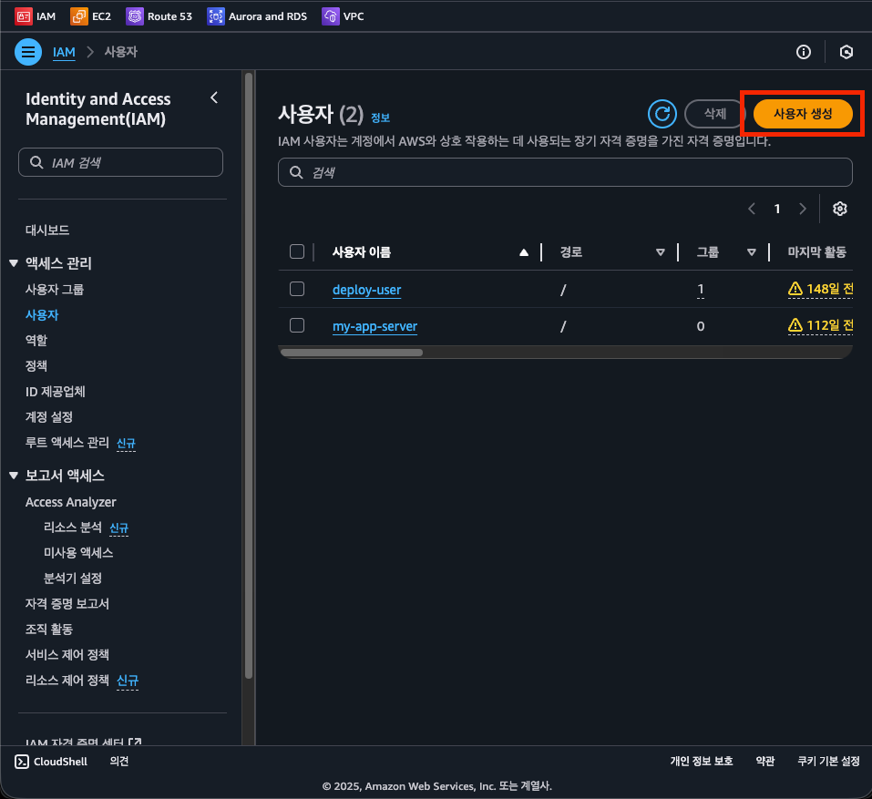  
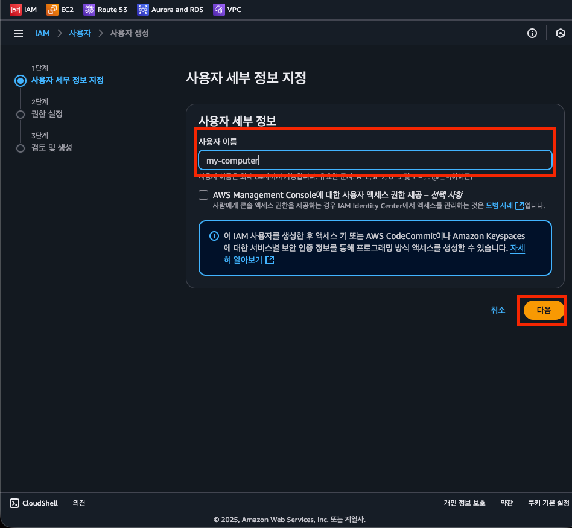  
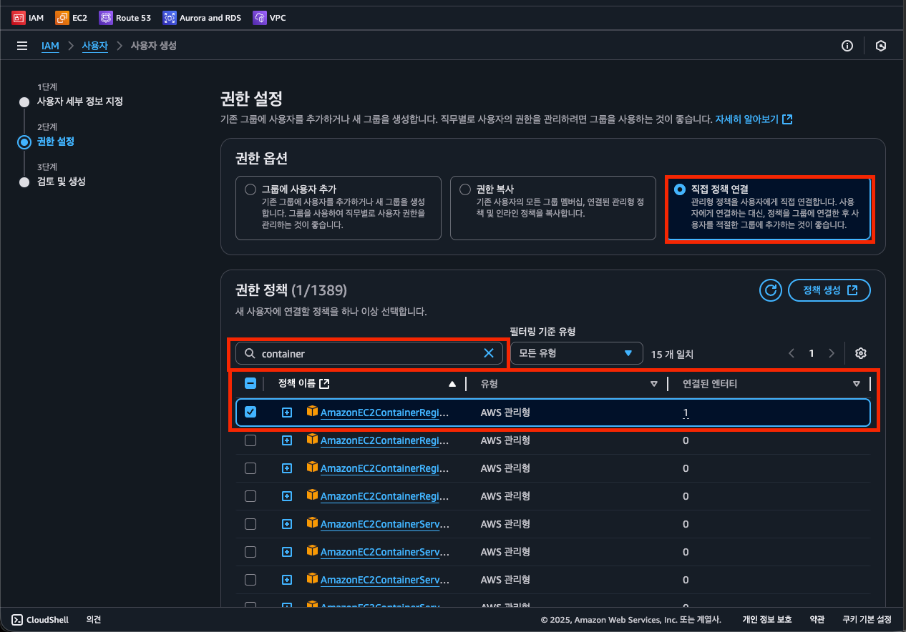  
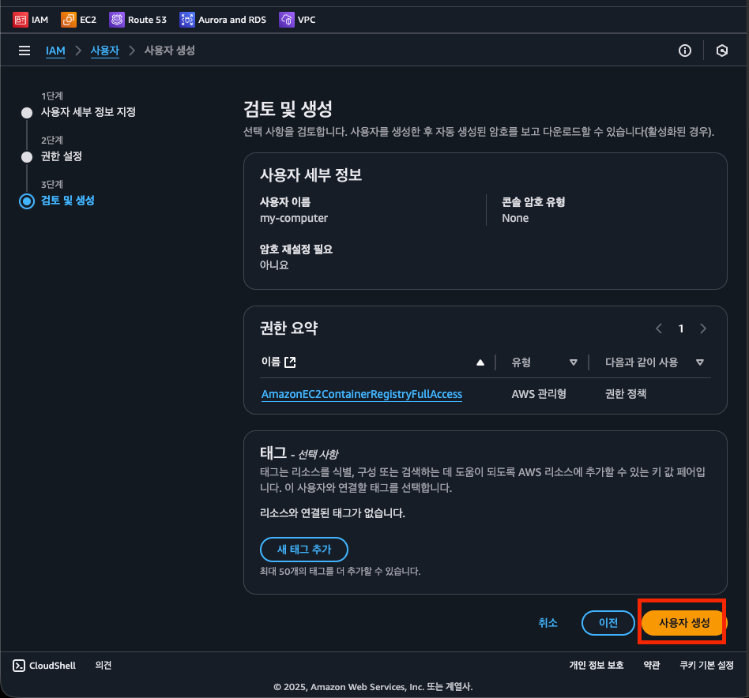  
2. Access Key 발급받기
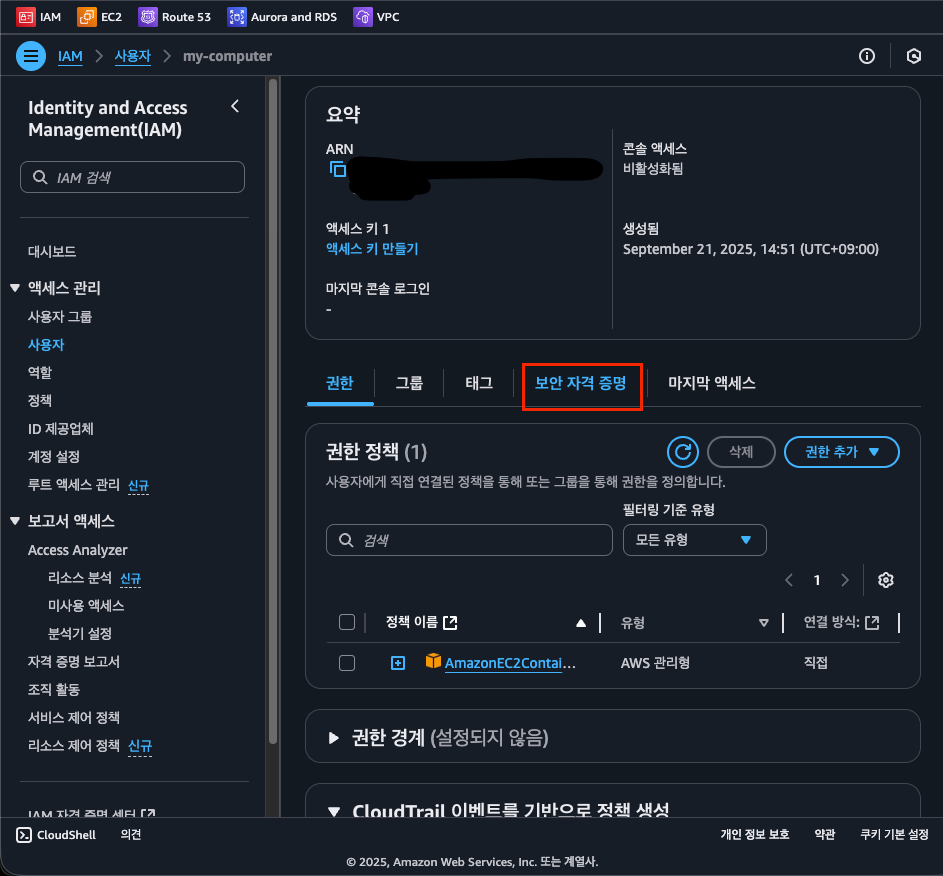  
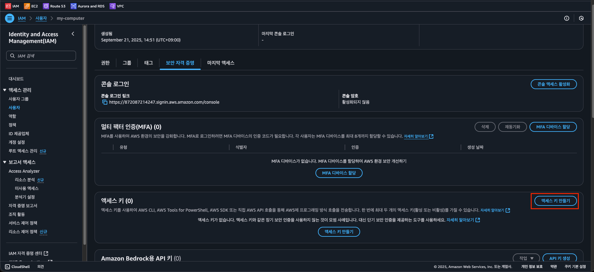  
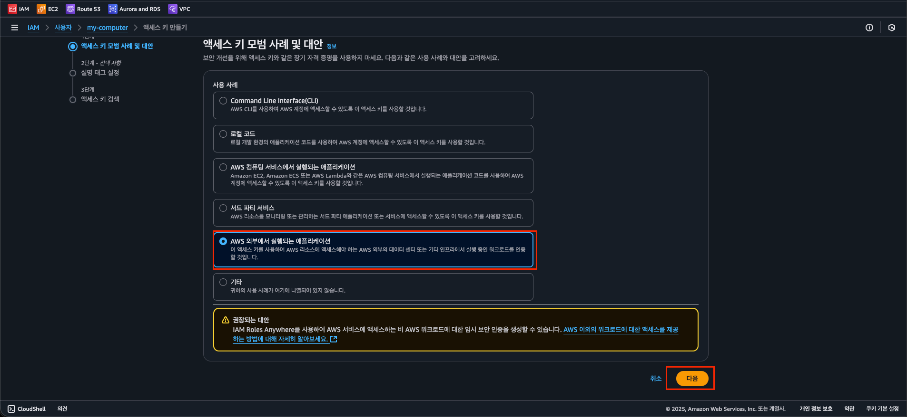
3. AWS CLI로 액세스 키 등록하기
    ```bash
    $ aws configure
    AWS Access Key ID [None]: <위에서 발급한 Key id>
    AWS Secret Access Key [None]: <위에서 발급한 Secret Access Key>
    Default region name [None]: ap-northeast-2
    Default output format [None]:
    ```
로컬  PC와 EC2 모두 설정한다.

## AWS ECR(Elastic Container Registry) 셋팅하기
Docker 이미지를 저장할 수 있는 저장소를 만들어보자.    
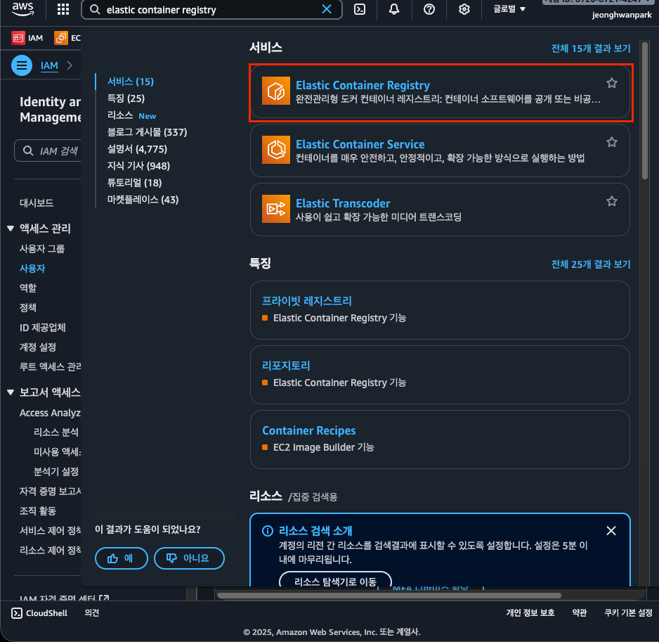  
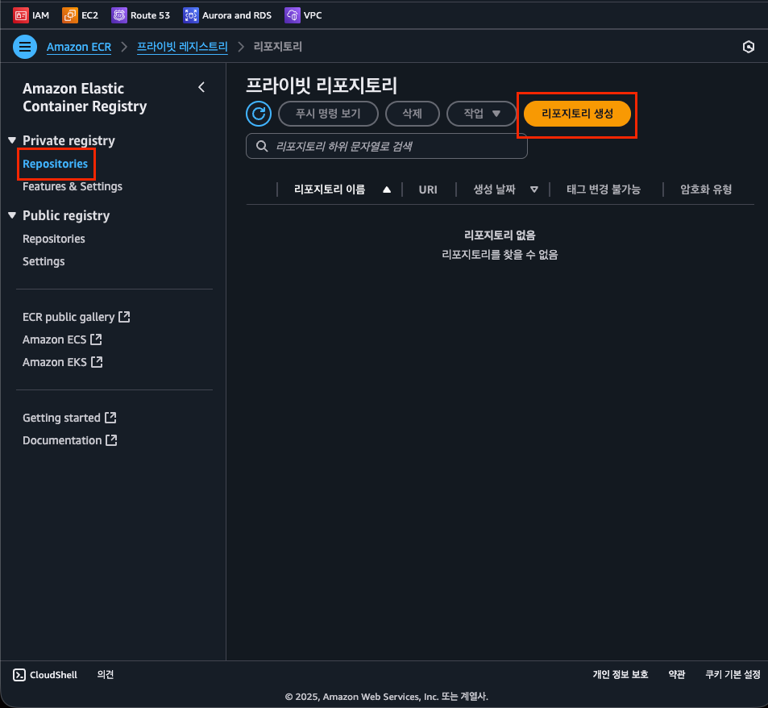  
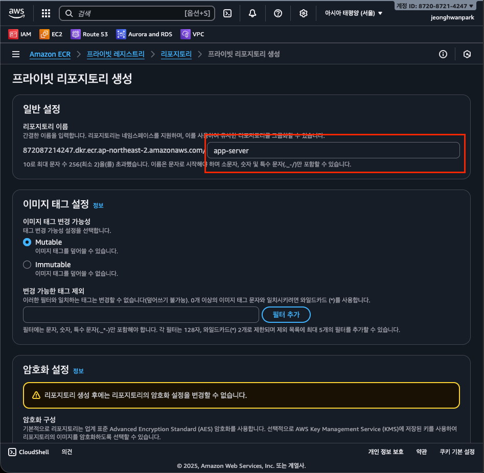  
일반적으로 하나의 리포지토리에는 한 종류의 이미지만 저장하고 관리한다.

이미지 빌드해서 AWS ECR에 Push, Pull 해보기

1. **Dockerfile 작성하기**

    ```bash
    FROM openjdk:17-jdk
    
    ENTRYPOINT ["/bin/bash", "-c", "sleep 500"]
    ```


2. **이미지 빌드 및 push 하기**
    - **이미지 Push할 때 어떤 명령어를 써야 하는 지 가르쳐주는 위치**

      > AWS ECR에 들어가서 ‘푸시 명령 보기’ 버튼을 누르면, 어떻게 이미지를 Push하면 되는 지 친절하게 설명이 나와있다.
      >

      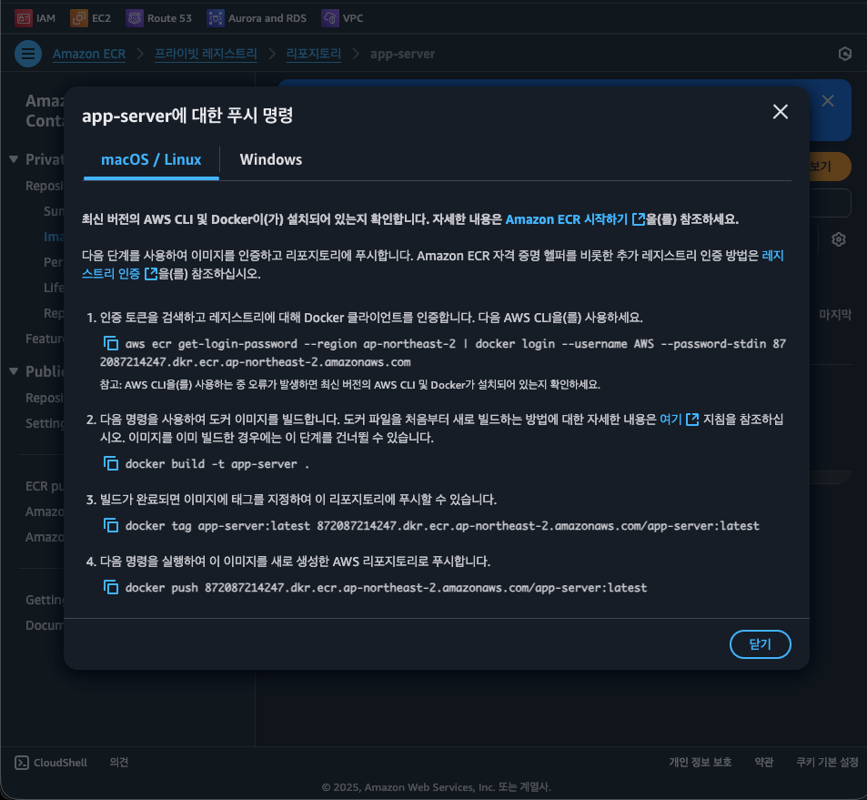


```bash
aws ecr get-login-password --region ap-northeast-2 | docker login --username AWS --password-stdin 872087214247.dkr.ecr.ap-northeast-2.amazonaws.com
docker build -t app-server .
docker tag app-server:latest 872087214247.dkr.ecr.ap-northeast-2.amazonaws.com/app-server:latest
docker push 872087214247.dkr.ecr.ap-northeast-2.amazonaws.com/app-server:latest
```
  

3. 이미지 PULL받기
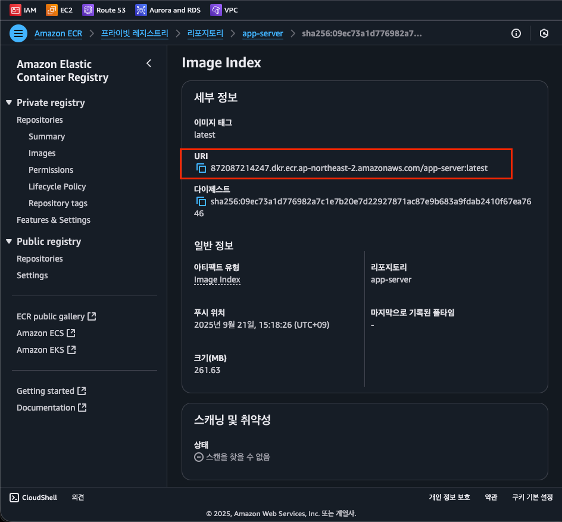
```
$ docker image rm -f [Container ID] # 기존 갖고있던 이미지 지우기
$ docker pull 872087214247.dkr.ecr.ap-northeast-2.amazonaws.com/app-server:latest
$ docker image ls
```
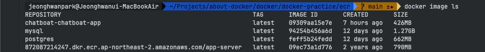